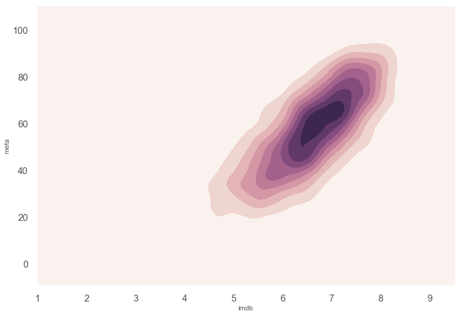

# Scraper


```python
import urllib.request
from bs4 import BeautifulSoup
import pandas as pd
from tqdm import tqdm_notebook
import seaborn as sns
sns.set_style("whitegrid")
from matplotlib import pyplot as plt
import numpy as np
%matplotlib inline
```


```python
'''
movie_names = []
movie_years = []
imdb_ratings = []
meta_ratings = []
movie_earnings = [] 
movie_genres = []
runtimes = []

pages = 10  # 10 pages per year.
start_year = 2000
end_year = 2018

for i in tqdm_notebook(range(start_year, end_year+1), total = end_year-start_year, unit = 'year'):
  k = 1
  for j in range(1, pages + 1):
    imdb_url = 'https://www.imdb.com/search/title?release_date=' + str(i) + '-01-01,' + str(i) + '-12-31&sort=num_votes,desc&start=' + str(k) + '&ref_=adv_nxt'
    page_unparsed = urllib.request.urlopen(imdb_url)
    page_parsed = BeautifulSoup(page_unparsed, 'html.parser')

    k += 50

    movie_divs = page_parsed.find_all('div', class_ = 'lister-item mode-advanced')

    for movie in movie_divs:
      skip_movie = False 

      meta_rating_unparsed = movie.find('div', class_ = 'inline-block ratings-metascore')
      gross_unparsed = movie.find_all('span', attrs = {'name' : 'nv'})

      if meta_rating_unparsed is None or gross_unparsed is None:
        continue
        
      temp = movie.find_all('span', attrs = {'name' : 'nv'})
      if len(temp) is not 2:
        continue
      else:
        movie_earnings.append(float(temp[1].string.strip('$').strip('M')))

      meta_ratings.append(int(meta_rating_unparsed.text.replace(" ", "").split("\n")[1]))
      movie_genres.append(movie.find('span', attrs = {'class' : 'genre'}).text.strip().split(",")[0])
      imdb_ratings.append(float(movie.find('div', class_ = 'inline-block ratings-imdb-rating').text))
      movie_names.append(movie.find('h3', class_ = 'lister-item-header').find('a').text)


      year = movie.find('span', class_ = 'lister-item-year text-muted unbold').text.split(" ")
      if len(year) == 1:
        movie_years.append(year[0][1:5])
      else:
        movie_years.append(year[1][1:5])

        
      runtimes.append(int(movie.find('span', class_ = 'runtime').text.strip('min')))
'''
```


    '\nmovie_names = []\nmovie_years = []\nimdb_ratings = []\nmeta_ratings = []\nmovie_earnings = [] \nmovie_genres = []\nruntimes = []\n\npages = 10  # 10 pages per year.\nstart_year = 2000\nend_year = 2018\n\nfor i in tqdm_notebook(range(start_year, end_year+1), total = end_year-start_year, unit = \'year\'):\n  k = 1\n  for j in range(1, pages + 1):\n    imdb_url = \'https://www.imdb.com/search/title?release_date=\' + str(i) + \'-01-01,\' + str(i) + \'-12-31&sort=num_votes,desc&start=\' + str(k) + \'&ref_=adv_nxt\'\n    page_unparsed = urllib.request.urlopen(imdb_url)\n    page_parsed = BeautifulSoup(page_unparsed, \'html.parser\')\n\n    k += 50\n\n    movie_divs = page_parsed.find_all(\'div\', class_ = \'lister-item mode-advanced\')\n\n    for movie in movie_divs:\n      skip_movie = False \n\n      meta_rating_unparsed = movie.find(\'div\', class_ = \'inline-block ratings-metascore\')\n      gross_unparsed = movie.find_all(\'span\', attrs = {\'name\' : \'nv\'})\n\n      if meta_rating_unparsed is None or gross_unparsed is None:\n        continue\n        \n      temp = movie.find_all(\'span\', attrs = {\'name\' : \'nv\'})\n      if len(temp) is not 2:\n        continue\n      else:\n        movie_earnings.append(float(temp[1].string.strip(\'$\').strip(\'M\')))\n\n      meta_ratings.append(int(meta_rating_unparsed.text.replace(" ", "").split("\n")[1]))\n      movie_genres.append(movie.find(\'span\', attrs = {\'class\' : \'genre\'}).text.strip().split(",")[0])\n      imdb_ratings.append(float(movie.find(\'div\', class_ = \'inline-block ratings-imdb-rating\').text))\n      movie_names.append(movie.find(\'h3\', class_ = \'lister-item-header\').find(\'a\').text)\n\n\n      year = movie.find(\'span\', class_ = \'lister-item-year text-muted unbold\').text.split(" ")\n      if len(year) == 1:\n        movie_years.append(year[0][1:5])\n      else:\n        movie_years.append(year[1][1:5])\n\n        \n      runtimes.append(int(movie.find(\'span\', class_ = \'runtime\').text.strip(\'min\')))\n'


```python
# movies = pd.DataFrame(list(zip(movie_names, movie_years, movie_genres, imdb_ratings, meta_ratings, movie_earnings, runtimes)), columns =['name', 'year', 'genre', 'imdb', 'meta', 'gross', 'runtime']) 
movies = pd.read_csv("movies.csv")
movies.drop("Unnamed: 0", axis = 1, inplace = True)
movies.drop([170, 1001], axis = 0, inplace = True)
```


```python
# movies.to_csv("movies.csv")
# files.download('movies.csv') 
```


```python
movies.describe()
```


<div>
<style scoped>
    .dataframe tbody tr th:only-of-type {
        vertical-align: middle;
    }

    .dataframe tbody tr th {
        vertical-align: top;
    }

    .dataframe thead th {
        text-align: right;
    }
</style>
<table border="1" class="dataframe">
  <thead>
    <tr style="text-align: right;">
      <th></th>
      <th>imdb</th>
      <th>meta</th>
      <th>gross</th>
      <th>runtime</th>
    </tr>
  </thead>
  <tbody>
    <tr>
      <th>count</th>
      <td>4877.000000</td>
      <td>4877.000000</td>
      <td>4877.000000</td>
      <td>4877.000000</td>
    </tr>
    <tr>
      <th>mean</th>
      <td>6.517572</td>
      <td>56.017839</td>
      <td>37.897115</td>
      <td>107.052696</td>
    </tr>
    <tr>
      <th>std</th>
      <td>0.971941</td>
      <td>17.860327</td>
      <td>68.181217</td>
      <td>18.182487</td>
    </tr>
    <tr>
      <th>min</th>
      <td>1.500000</td>
      <td>1.000000</td>
      <td>0.000000</td>
      <td>61.000000</td>
    </tr>
    <tr>
      <th>25%</th>
      <td>6.000000</td>
      <td>43.000000</td>
      <td>0.720000</td>
      <td>95.000000</td>
    </tr>
    <tr>
      <th>50%</th>
      <td>6.600000</td>
      <td>57.000000</td>
      <td>11.440000</td>
      <td>104.000000</td>
    </tr>
    <tr>
      <th>75%</th>
      <td>7.200000</td>
      <td>69.000000</td>
      <td>45.170000</td>
      <td>116.000000</td>
    </tr>
    <tr>
      <th>max</th>
      <td>9.000000</td>
      <td>100.000000</td>
      <td>936.660000</td>
      <td>366.000000</td>
    </tr>
  </tbody>
</table>
</div>


```python
movies.head()
```


<div>
<style scoped>
    .dataframe tbody tr th:only-of-type {
        vertical-align: middle;
    }

    .dataframe tbody tr th {
        vertical-align: top;
    }

    .dataframe thead th {
        text-align: right;
    }
</style>
<table border="1" class="dataframe">
  <thead>
    <tr style="text-align: right;">
      <th></th>
      <th>name</th>
      <th>year</th>
      <th>genre</th>
      <th>imdb</th>
      <th>meta</th>
      <th>gross</th>
      <th>runtime</th>
    </tr>
  </thead>
  <tbody>
    <tr>
      <th>0</th>
      <td>Gladiator</td>
      <td>2000</td>
      <td>Action</td>
      <td>8.5</td>
      <td>67</td>
      <td>187.71</td>
      <td>155</td>
    </tr>
    <tr>
      <th>1</th>
      <td>Memento</td>
      <td>2000</td>
      <td>Mystery</td>
      <td>8.5</td>
      <td>80</td>
      <td>25.54</td>
      <td>113</td>
    </tr>
    <tr>
      <th>2</th>
      <td>Snatch</td>
      <td>2000</td>
      <td>Comedy</td>
      <td>8.3</td>
      <td>55</td>
      <td>30.33</td>
      <td>102</td>
    </tr>
    <tr>
      <th>3</th>
      <td>Requiem for a Dream</td>
      <td>2000</td>
      <td>Drama</td>
      <td>8.3</td>
      <td>68</td>
      <td>3.64</td>
      <td>102</td>
    </tr>
    <tr>
      <th>4</th>
      <td>X-Men</td>
      <td>2000</td>
      <td>Action</td>
      <td>7.4</td>
      <td>64</td>
      <td>157.30</td>
      <td>104</td>
    </tr>
  </tbody>
</table>
</div>


# Theme


```python
import matplotlib.style as style
style.available
```


    ['bmh',
     'classic',
     'dark_background',
     'fast',
     'fivethirtyeight',
     'ggplot',
     'grayscale',
     'seaborn-bright',
     'seaborn-colorblind',
     'seaborn-dark-palette',
     'seaborn-dark',
     'seaborn-darkgrid',
     'seaborn-deep',
     'seaborn-muted',
     'seaborn-notebook',
     'seaborn-paper',
     'seaborn-pastel',
     'seaborn-poster',
     'seaborn-talk',
     'seaborn-ticks',
     'seaborn-white',
     'seaborn-whitegrid',
     'seaborn',
     'Solarize_Light2',
     'tableau-colorblind10',
     '_classic_test']


```python
style.use('seaborn-poster') #sets the size of the charts
style.use('ggplot')
```

**Palettes :**

Accent, Accent_r, Blues, Blues_r, BrBG, BrBG_r, BuGn, BuGn_r, BuPu, BuPu_r, CMRmap, CMRmap_r, Dark2, Dark2_r, GnBu, GnBu_r, Greens, Greens_r, Greys, Greys_r, OrRd, OrRd_r, Oranges, Oranges_r, PRGn, PRGn_r, Paired, Paired_r, Pastel1, Pastel1_r, Pastel2, Pastel2_r, PiYG, PiYG_r, PuBu, PuBuGn, PuBuGn_r, PuBu_r, PuOr, PuOr_r, PuRd, PuRd_r, Purples, Purples_r, RdBu, RdBu_r, RdGy, RdGy_r, RdPu, RdPu_r, RdYlBu, RdYlBu_r, RdYlGn, RdYlGn_r, Reds, Reds_r, Set1, Set1_r, Set2, Set2_r, Set3, Set3_r, Spectral, Spectral_r, Vega10, Vega10_r, Vega20, Vega20_r, Vega20b, Vega20b_r, Vega20c, Vega20c_r, Wistia, Wistia_r, YlGn, YlGnBu, YlGnBu_r, YlGn_r, YlOrBr, YlOrBr_r, YlOrRd, YlOrRd_r, afmhot, afmhot_r, autumn, autumn_r, binary, binary_r, bone, bone_r, brg, brg_r, bwr, bwr_r, cool, cool_r, coolwarm, coolwarm_r, copper, copper_r, cubehelix, cubehelix_r, flag, flag_r, gist_earth, gist_earth_r, gist_gray, gist_gray_r, gist_heat, gist_heat_r, gist_ncar, gist_ncar_r, gist_rainbow, gist_rainbow_r, gist_stern, gist_stern_r, gist_yarg, gist_yarg_r, gnuplot, gnuplot2, gnuplot2_r, gnuplot_r, gray, gray_r, hot, hot_r, hsv, hsv_r, icefire, icefire_r, inferno, inferno_r, jet, jet_r, magma, magma_r, mako, mako_r, nipy_spectral, nipy_spectral_r, ocean, ocean_r, pink, pink_r, plasma, plasma_r, prism, prism_r, rainbow, rainbow_r, rocket, rocket_r, seismic, seismic_r, spectral, spectral_r, spring, spring_r, summer, summer_r, tab10, tab10_r, tab20, tab20_r, tab20b, tab20b_r, tab20c, tab20c_r, terrain, terrain_r, viridis, viridis_r, vlag, vlag_r, winter, winter_r

# Rating


```python
sns.lmplot(x = 'imdb', y = 'meta', data = movies, scatter_kws={"s": 10})
```


    <seaborn.axisgrid.FacetGrid at 0x24a65eb9080>


```python
sns.kdeplot(movies['imdb'], movies['meta'], cmap = sns.cubehelix_palette(light = 1, as_cmap = True), shade = True)
```


    <matplotlib.axes._subplots.AxesSubplot at 0x24a67f75cc0>





There is a high positive correlation between both the scoring metrics.

**Inference 1: ** People and critics tend to have the same view on movies. Both have the same opinions one movies with a rating of 6 (or 60).


```python
fig, ax = plt.subplots()
sns.kdeplot(movies['imdb'], ax = ax)
sns.kdeplot(movies['meta']/10, ax = ax)
```


    <matplotlib.axes._subplots.AxesSubplot at 0x24a6800f080>


**Inference 2 : ** Meta ratings follow a normal distribution while IMDb ratings tend to favour the 5 - 8 range.


```python
dicts = {}
for genre in movies['genre'].unique():
  dicts[genre] = movies[movies['genre'] == genre]['imdb']
               
temp = pd.DataFrame(dicts)

fig, ax = plt.subplots(figsize=(100,5))
sns.violinplot(temp)
plt.show()
```


**Inference 3: ** Biography movies tend to have the high ratings.


```python
fig, ax = plt.subplots(figsize=(21,8))
ax = sns.boxplot(x = 'genre', y = 'imdb', data = movies)
plt.show()
```


**Inference 4: ** In the world of movies, there are a **lot** of outliers. I don't think a machine learning model could work well on datasets like this (to predict the likeability of a movie)- unless we have more attributes. 


```python
# movie with lowest imdb rating
movies.iloc[movies['imdb'].idxmin()]
```


    name       Beyond the Lights
    year                    2014
    genre                  Drama
    imdb                     6.9
    meta                      73
    gross                  14.62
    runtime                  116
    Name: 3993, dtype: object


```python
# movie with highest imdb rating
movies.iloc[movies['imdb'].idxmax()]
```


    name       Iron Man
    year           2008
    genre        Action
    imdb            7.9
    meta             79
    gross        318.41
    runtime         126
    Name: 2174, dtype: object


```python
# movie with lowest meta rating
movies.iloc[movies['meta'].idxmin()]
```


    name       Welcome to Marwen
    year                    2018
    genre              Biography
    imdb                       6
    meta                      40
    gross                  10.76
    runtime                  116
    Name: 4871, dtype: object


```python
# movie with highest imdb rating
movies.iloc[movies['meta'].idxmax()]
```


    name       Maleficent
    year             2014
    genre          Action
    imdb                7
    meta               56
    gross          241.41
    runtime            97
    Name: 3797, dtype: object


**Inference 5 - 8: ** 
  * IMDb:
    * Highest rated: The Dark Knight (2008). Score: 9
    * Lowest rated: Saving Christmas (2014). Score: 1.5
  * Metacritic:
      * Highest rated: Boyhood(2014). Score: 100
      * Highest rated: Death of a Nation(2018). Score: 1

# Gross

Each movie had anywhere from 1 to 3 genres. To simplify the process, I figured the first genre for each movie would be most accurate. Looking at the dataset, only the first 9 genres are the most abundant.


```python
# sns.pairplot(movies, hue = 'genre')
# sns.lmplot(x = 'imdb', y = 'meta', data = movies, hue = 'genre')
```


```python
sns.lmplot(x = 'imdb', y = 'gross', data = movies.sample(1500), scatter_kws={"s": 5})
```


    <seaborn.axisgrid.FacetGrid at 0x24a6828e4a8>


**Inference 9: ** No correlation between IMDb scores and movie box office. Same can be inferred for meta scores.


```python
# be default, barplot shows mean. beow graph shows that family movies had the highest grossing per movie. 
fig, ax = plt.subplots(figsize=(18,4))
ax = sns.barplot(x = 'genre', y = 'gross', data = movies, palette=("Blues_d"))
ax.set_xticklabels(ax.get_xticklabels(), rotation = 30)
plt.title('mean gross per genre')
plt.show()
```


Hmmm. Notice the black line for family movies. It tells us that there is a high change of it being erroneous.


```python
movies['genre'].value_counts()
```


    Comedy         1297
    Drama          1041
    Action          962
    Crime           351
    Biography       321
    Animation       256
    Adventure       242
    Horror          180
    Documentary     176
    Mystery          15
    Fantasy          14
    Romance           8
    Thriller          6
    Musical           2
    Family            2
    Music             2
    Sci-Fi            1
    War               1
    Name: genre, dtype: int64


```python
movies[movies['genre'] == 'Family']
```


<div>
<style scoped>
    .dataframe tbody tr th:only-of-type {
        vertical-align: middle;
    }

    .dataframe tbody tr th {
        vertical-align: top;
    }

    .dataframe thead th {
        text-align: right;
    }
</style>
<table border="1" class="dataframe">
  <thead>
    <tr style="text-align: right;">
      <th></th>
      <th>name</th>
      <th>year</th>
      <th>genre</th>
      <th>imdb</th>
      <th>meta</th>
      <th>gross</th>
      <th>runtime</th>
    </tr>
  </thead>
  <tbody>
    <tr>
      <th>1201</th>
      <td>Raise Your Voice</td>
      <td>2004</td>
      <td>Family</td>
      <td>5.9</td>
      <td>33</td>
      <td>10.41</td>
      <td>103</td>
    </tr>
    <tr>
      <th>4502</th>
      <td>Beauty and the Beast</td>
      <td>2017</td>
      <td>Family</td>
      <td>7.2</td>
      <td>65</td>
      <td>504.01</td>
      <td>129</td>
    </tr>
  </tbody>
</table>
</div>


```python
temp = movies.groupby('genre').sum()
temp['ppm'] = temp['gross'] / temp['runtime']
temp.sort_values('ppm', ascending =False).head()
```


<div>
<style scoped>
    .dataframe tbody tr th:only-of-type {
        vertical-align: middle;
    }

    .dataframe tbody tr th {
        vertical-align: top;
    }

    .dataframe thead th {
        text-align: right;
    }
</style>
<table border="1" class="dataframe">
  <thead>
    <tr style="text-align: right;">
      <th></th>
      <th>imdb</th>
      <th>meta</th>
      <th>gross</th>
      <th>runtime</th>
      <th>ppm</th>
    </tr>
    <tr>
      <th>genre</th>
      <th></th>
      <th></th>
      <th></th>
      <th></th>
      <th></th>
    </tr>
  </thead>
  <tbody>
    <tr>
      <th>Family</th>
      <td>13.1</td>
      <td>98</td>
      <td>514.42</td>
      <td>232</td>
      <td>2.217328</td>
    </tr>
    <tr>
      <th>Animation</th>
      <td>1720.9</td>
      <td>15449</td>
      <td>24947.05</td>
      <td>23922</td>
      <td>1.042850</td>
    </tr>
    <tr>
      <th>Action</th>
      <td>6054.4</td>
      <td>47835</td>
      <td>67386.31</td>
      <td>108042</td>
      <td>0.623705</td>
    </tr>
    <tr>
      <th>Adventure</th>
      <td>1570.0</td>
      <td>13489</td>
      <td>16524.08</td>
      <td>26933</td>
      <td>0.613525</td>
    </tr>
    <tr>
      <th>Mystery</th>
      <td>98.8</td>
      <td>832</td>
      <td>949.80</td>
      <td>1638</td>
      <td>0.579853</td>
    </tr>
  </tbody>
</table>
</div>


**Inference 12: ** Family movies had the best profit per movie value. (514.42 million for 2 movies!) and earned a whopping 2.2 million dollars for 1 minute of screentime. This amount was largely due to Beauty and the Beast.

**Inference 13:** The most profitable movie genres are Family, Animation, and Action.


```python
fig, ax = plt.subplots(figsize=(18,4))
ax = sns.barplot(x = 'genre', y = 'gross', data = movies, estimator = sum, palette=("Blues_d"))
ax.set_xticklabels(ax.get_xticklabels(),rotation=90)
plt.title('sum of grosses per genre')
plt.show()
```


**Inference 14: ** Action movies had the most profits (67k million), followed by comedy movies (34k million) and then animation movies (25k million).

# Genre


```python
fig, ax = plt.subplots(figsize=(18,4))
ax = sns.countplot(x = 'genre', data = movies, palette=("Blues_d"))
ax.set_xticklabels(ax.get_xticklabels() ,rotation = 30)
plt.title('number of movies per genre')
plt.show()
```


**Inference 14:**: Comedy movies were the most frequently released, followed by drama and action movies.


```python
fig, ax = plt.subplots(figsize=(18,4))
ax = sns.barplot(x = 'genre', y = 'imdb', data = movies, palette=("Blues_d"))
ax.set_xticklabels(ax.get_xticklabels(), rotation = 30)
plt.title('average imdb rating per genre')
plt.show()
```


**Inference 15:**For IMDb ratings, on average, horror movies got the lowest ratings while war, documentary, and musical movies seem to get the highest. 

**Inference 16:** IMDb movies tend to approximately get the same ratings regardless of genre.


```python
fig, ax = plt.subplots(figsize=(18,4))
ax = sns.barplot(x = 'genre', y = 'meta', data = movies, palette=("Blues_d"))
ax.set_xticklabels(ax.get_xticklabels(), rotation = 30)
plt.title('average meta rating per genre')
plt.show()
```


**Inference 17:**: For meta ratings, documentary movies get the highest average rating.

**Inference 18:**: Mean ratings for each genre for metacritic tend to vary for each genre, unlike IMDb ratings.

**Inference 19:** Horror movies are the most disliked. 

**Inference 20:** Documentary movies are the most liked.


```python
fig, ax = plt.subplots()
sns.kdeplot(movies['imdb'], ax=ax)
sns.kdeplot(movies['meta']/10, ax=ax)
```


    <matplotlib.axes._subplots.AxesSubplot at 0x24a6a8c40b8>


# Runtime


```python
fig, ax = plt.subplots(figsize=(18,4))
ax = sns.barplot(x = 'genre', y = 'runtime', data = movies, palette=("Blues_d"))
ax.set_xticklabels(ax.get_xticklabels(), rotation = 30)
plt.title('average runtime per genre')
plt.show()
```


```python
movies.groupby(['genre']).mean().sort_values('runtime').iloc[0]
```


    imdb        7.20
    meta       57.50
    gross       0.08
    runtime    90.50
    Name: Musical, dtype: float64


```python
movies.groupby(['genre']).mean().sort_values('runtime').iloc[-1]
```


    imdb         7.036449
    meta        63.781931
    gross       25.985452
    runtime    117.529595
    Name: Biography, dtype: float64


**Inference 21:** Biography movies had the longest average duration. (117 mins). Musical movies had the lowest. (90 minutes)


```python
movies.loc[movies['runtime'].idxmin()]
```


    name       Ghosts of the Abyss
    year                      2003
    genre              Documentary
    imdb                       6.9
    meta                        67
    gross                    17.09
    runtime                     61
    Name: 1020, dtype: object


```python
movies.loc[movies['runtime'].idxmax()]
```


    name       The Best of Youth
    year                    2003
    genre                  Drama
    imdb                     8.5
    meta                      89
    gross                   0.25
    runtime                  366
    Name: 946, dtype: object


**Inference 22:** Longest movie was 'The Best of Youth', which ran for 366 minutes (6 hours). Shortest movie was 'Ghost of the Abyss', which ran for 61 minutes. (1 hour)


```python
sns.jointplot(x = 'runtime', y = 'gross', data = movies,  kind = 'reg', scatter_kws={"s": 3})
plt.show()
```


**Inference 23:** Runtime and box office are slightly correlated. Meaning, if the duration of a movie is more, it earns more. (with a probability of 0.3)


# Year


```python
movies.groupby('year').sum()
```


<div>
<style scoped>
    .dataframe tbody tr th:only-of-type {
        vertical-align: middle;
    }

    .dataframe tbody tr th {
        vertical-align: top;
    }

    .dataframe thead th {
        text-align: right;
    }
</style>
<table border="1" class="dataframe">
  <thead>
    <tr style="text-align: right;">
      <th></th>
      <th>imdb</th>
      <th>meta</th>
      <th>gross</th>
      <th>runtime</th>
    </tr>
    <tr>
      <th>year</th>
      <th></th>
      <th></th>
      <th></th>
      <th></th>
    </tr>
  </thead>
  <tbody>
    <tr>
      <th>2000</th>
      <td>1644.9</td>
      <td>13595</td>
      <td>7413.40</td>
      <td>27113</td>
    </tr>
    <tr>
      <th>2001</th>
      <td>1728.3</td>
      <td>14157</td>
      <td>7956.77</td>
      <td>28360</td>
    </tr>
    <tr>
      <th>2002</th>
      <td>1774.5</td>
      <td>15066</td>
      <td>9072.36</td>
      <td>28557</td>
    </tr>
    <tr>
      <th>2003</th>
      <td>1705.4</td>
      <td>14524</td>
      <td>8771.08</td>
      <td>28026</td>
    </tr>
    <tr>
      <th>2004</th>
      <td>1753.3</td>
      <td>14558</td>
      <td>9186.20</td>
      <td>28528</td>
    </tr>
    <tr>
      <th>2005</th>
      <td>1748.4</td>
      <td>14947</td>
      <td>8807.64</td>
      <td>28870</td>
    </tr>
    <tr>
      <th>2006</th>
      <td>1897.1</td>
      <td>16516</td>
      <td>9157.57</td>
      <td>31077</td>
    </tr>
    <tr>
      <th>2007</th>
      <td>1846.1</td>
      <td>15657</td>
      <td>9321.09</td>
      <td>29943</td>
    </tr>
    <tr>
      <th>2008</th>
      <td>1732.3</td>
      <td>14605</td>
      <td>9663.57</td>
      <td>28448</td>
    </tr>
    <tr>
      <th>2009</th>
      <td>1734.7</td>
      <td>14517</td>
      <td>10388.39</td>
      <td>28545</td>
    </tr>
    <tr>
      <th>2010</th>
      <td>1718.8</td>
      <td>14939</td>
      <td>10085.55</td>
      <td>27970</td>
    </tr>
    <tr>
      <th>2011</th>
      <td>1757.8</td>
      <td>15134</td>
      <td>9947.34</td>
      <td>28678</td>
    </tr>
    <tr>
      <th>2012</th>
      <td>1633.6</td>
      <td>14207</td>
      <td>10321.71</td>
      <td>26685</td>
    </tr>
    <tr>
      <th>2013</th>
      <td>1794.9</td>
      <td>15628</td>
      <td>10685.90</td>
      <td>29671</td>
    </tr>
    <tr>
      <th>2014</th>
      <td>1689.4</td>
      <td>14648</td>
      <td>10544.93</td>
      <td>27719</td>
    </tr>
    <tr>
      <th>2015</th>
      <td>1480.1</td>
      <td>13127</td>
      <td>10497.37</td>
      <td>24504</td>
    </tr>
    <tr>
      <th>2016</th>
      <td>1546.5</td>
      <td>13733</td>
      <td>11253.12</td>
      <td>25662</td>
    </tr>
    <tr>
      <th>2017</th>
      <td>1363.3</td>
      <td>12606</td>
      <td>10532.35</td>
      <td>22917</td>
    </tr>
    <tr>
      <th>2018</th>
      <td>1228.9</td>
      <td>10953</td>
      <td>11213.83</td>
      <td>20714</td>
    </tr>
  </tbody>
</table>
</div>


```python
fig, ax = plt.subplots(figsize=(18,4))
ax = sns.barplot(x = 'year', y = 'gross', data = movies, palette=("Blues_d"))
ax.set_xticklabels(ax.get_xticklabels(), rotation = 30)
plt.title('average gross per year')
plt.show()
```


Hmm. The black bars indicate that there's a high chance of error. Guess this is what happens with semeingly unpredictable data like movies. 

**Inference 24:** Average earning for movies increased as time went on. 


```python
sns.countplot(x = 'year', data = movies, palette=("Blues_d"))
plt.xticks(rotation = 45)
```


    (array([ 0,  1,  2,  3,  4,  5,  6,  7,  8,  9, 10, 11, 12, 13, 14, 15, 16,
            17, 18]), <a list of 19 Text xticklabel objects>)


```python
sns.lmplot(x = 'imdb', y = 'meta', data = movies, scatter_kws={"s": 10}, hue = 'year')
```


    <seaborn.axisgrid.FacetGrid at 0x24a6aab2b70>


```python
movies.groupby('year').mean()
```


<div>
<style scoped>
    .dataframe tbody tr th:only-of-type {
        vertical-align: middle;
    }

    .dataframe tbody tr th {
        vertical-align: top;
    }

    .dataframe thead th {
        text-align: right;
    }
</style>
<table border="1" class="dataframe">
  <thead>
    <tr style="text-align: right;">
      <th></th>
      <th>imdb</th>
      <th>meta</th>
      <th>gross</th>
      <th>runtime</th>
    </tr>
    <tr>
      <th>year</th>
      <th></th>
      <th></th>
      <th></th>
      <th></th>
    </tr>
  </thead>
  <tbody>
    <tr>
      <th>2000</th>
      <td>6.475984</td>
      <td>53.523622</td>
      <td>29.186614</td>
      <td>106.744094</td>
    </tr>
    <tr>
      <th>2001</th>
      <td>6.497368</td>
      <td>53.221805</td>
      <td>29.912669</td>
      <td>106.616541</td>
    </tr>
    <tr>
      <th>2002</th>
      <td>6.476277</td>
      <td>54.985401</td>
      <td>33.110803</td>
      <td>104.222628</td>
    </tr>
    <tr>
      <th>2003</th>
      <td>6.534100</td>
      <td>55.647510</td>
      <td>33.605670</td>
      <td>107.379310</td>
    </tr>
    <tr>
      <th>2004</th>
      <td>6.566667</td>
      <td>54.524345</td>
      <td>34.405243</td>
      <td>106.846442</td>
    </tr>
    <tr>
      <th>2005</th>
      <td>6.451661</td>
      <td>55.154982</td>
      <td>32.500517</td>
      <td>106.531365</td>
    </tr>
    <tr>
      <th>2006</th>
      <td>6.474744</td>
      <td>56.368601</td>
      <td>31.254505</td>
      <td>106.064846</td>
    </tr>
    <tr>
      <th>2007</th>
      <td>6.523322</td>
      <td>55.325088</td>
      <td>32.936714</td>
      <td>105.805654</td>
    </tr>
    <tr>
      <th>2008</th>
      <td>6.463806</td>
      <td>54.496269</td>
      <td>36.058097</td>
      <td>106.149254</td>
    </tr>
    <tr>
      <th>2009</th>
      <td>6.472761</td>
      <td>54.167910</td>
      <td>38.762649</td>
      <td>106.511194</td>
    </tr>
    <tr>
      <th>2010</th>
      <td>6.535361</td>
      <td>56.802281</td>
      <td>38.348099</td>
      <td>106.349810</td>
    </tr>
    <tr>
      <th>2011</th>
      <td>6.486347</td>
      <td>55.845018</td>
      <td>36.706052</td>
      <td>105.822878</td>
    </tr>
    <tr>
      <th>2012</th>
      <td>6.482540</td>
      <td>56.376984</td>
      <td>40.959167</td>
      <td>105.892857</td>
    </tr>
    <tr>
      <th>2013</th>
      <td>6.550730</td>
      <td>57.036496</td>
      <td>38.999635</td>
      <td>108.288321</td>
    </tr>
    <tr>
      <th>2014</th>
      <td>6.573541</td>
      <td>56.996109</td>
      <td>41.030856</td>
      <td>107.856031</td>
    </tr>
    <tr>
      <th>2015</th>
      <td>6.578222</td>
      <td>58.342222</td>
      <td>46.654978</td>
      <td>108.906667</td>
    </tr>
    <tr>
      <th>2016</th>
      <td>6.580851</td>
      <td>58.438298</td>
      <td>47.885617</td>
      <td>109.200000</td>
    </tr>
    <tr>
      <th>2017</th>
      <td>6.585990</td>
      <td>60.898551</td>
      <td>50.880918</td>
      <td>110.710145</td>
    </tr>
    <tr>
      <th>2018</th>
      <td>6.571658</td>
      <td>58.572193</td>
      <td>59.967005</td>
      <td>110.770053</td>
    </tr>
  </tbody>
</table>
</div>


